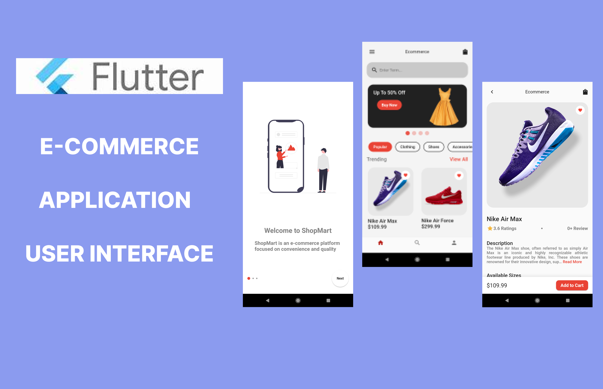

  <h3><b>Flutter Ecommerce UI</b></h3>

<!-- TABLE OF CONTENTS -->

# 📗 Table of Contents

- [📗 Table of Contents](#-table-of-contents)

  - [Tech Stack ](#tech-stack-)
  - [Key Features ](#key-features-)
  - [💻 Getting Started ](#-getting-started-)
    - [Prerequisites](#prerequisites)
    - [Setup](#setup)
    - [Install](#install)
    - [Run](#run)
  - [👥 Authors ](#-authors-)
  - [🔭 Future Features ](#-future-features-)
  - [🤝 Contributing ](#-contributing-)
  - [⭐️ Show your support ](#️-show-your-support-)
  - [🙏 Acknowledgments ](#-acknowledgments-)
  - [📝 License ](#-license-)

  

    <h3><b>FLUTTER ECOMMERCE UI</b></h3>
  

<!-- PROJECT DESCRIPTION -->

# FLUTTER ECOMMERCE UI 

Learn to create a complete E-Commerce App in Flutter. Splash Screen, Onboarding Screens, User Authentications, Fetch products by categories, and read descriptions. Enhance your proficiency in application development and craft a seamless shopping interface!
.

## ScreenShots of the APP

## Design <a name="built-with">

## 🛠 Built With <a name="built-with">

  <ul>
      <li>Flutter </li>
      <li>Dart</li>
</a>

### Tech Stack 

  
Client

    <li><a href="https://github.com/kennedyowusu/ecommerce-ui">FRONTEND</a><li>

<a href="#readme-top">front to top</a>

### Demo User

- Email Address: kobicypher@test.com
- Password: 123456

<!-- Key Features -->

## Key Features 

- Created a Flutter App UI
- Splash Screen
- Onboarding Screens
- User Authentications
- Fetch Product based on Categories
<!-- GETTING STARTED -->

## 💻 Getting Started 

### Prerequisites

- Get started with [Flutter](https://flutter.dev/)

- Get started with [DART](https://dart.dev/guides).

### Setup

- Clone this repository by running `git clone https://github.com/kennedyowusu/ecommerce-ui` in your command line.

- Navigate to the repository by running `cd ecommerce-ui`.

### Install

- Run `bundle install` to install all the gems.

### Run

- flutter pub get
- Start Emulator or Actual device

<a href="#readme-top">front to top</a>

## 👥 Author 

👤 **KENNEDY OWUSU**

- [GitHub](https://github.com/kennedyowusu)
- [Twitter](https://twitter.com/_iamkobby)
- [LinkedIn](www.linkedin.com/in/kennedy-owusu)

<a href="#readme-top">back to top</a>

<!-- FUTURE FEATURES -->

## 🔭 Future Features 

- [ ] **Connect it to Backend**

<a href="#readme-top">back to top</a>

<!-- CONTRIBUTING -->

## 🤝 Contributing 

Contributions, issues, and feature requests are welcome!

Feel free to check the [issues page](https://github.com/kennedyowusu/ecommerce-ui/issues)

<a href="#readme-top">back to top</a>

<!-- SUPPORT -->

## ⭐️ Show your support 

Give a ⭐️ if you like this project!

<a href="#readme-top">back to top</a>

## 🙏 Acknowledgments 

- Thank you for visiting.

(<a href="#readme-top">back to top</a>)

<!-- LICENSE -->

## 📝 License 

This project is [MIT](./LICENSE) licensed.

<a href="#readme-top">back to top</a>

